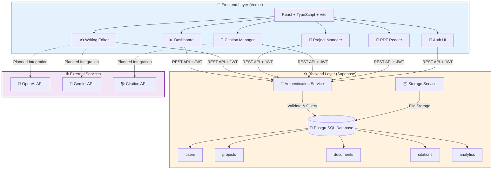
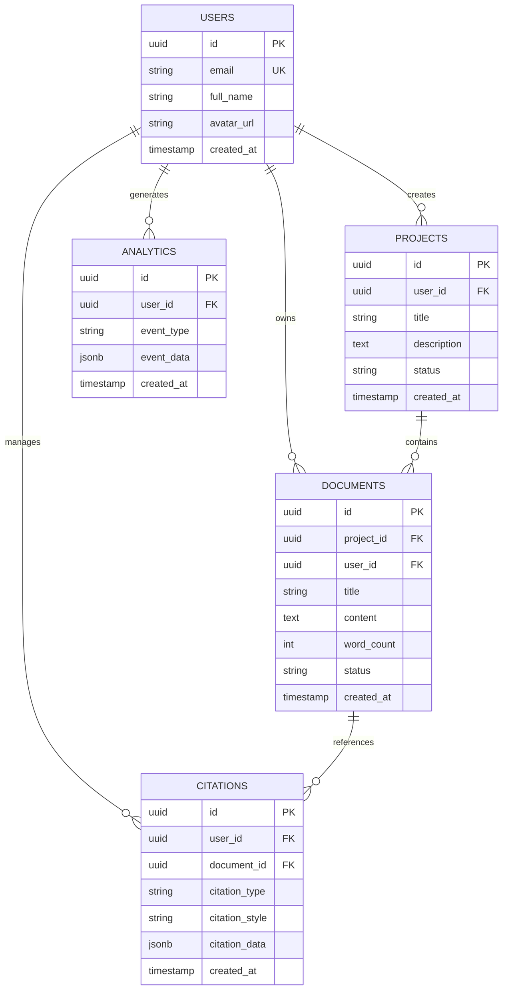
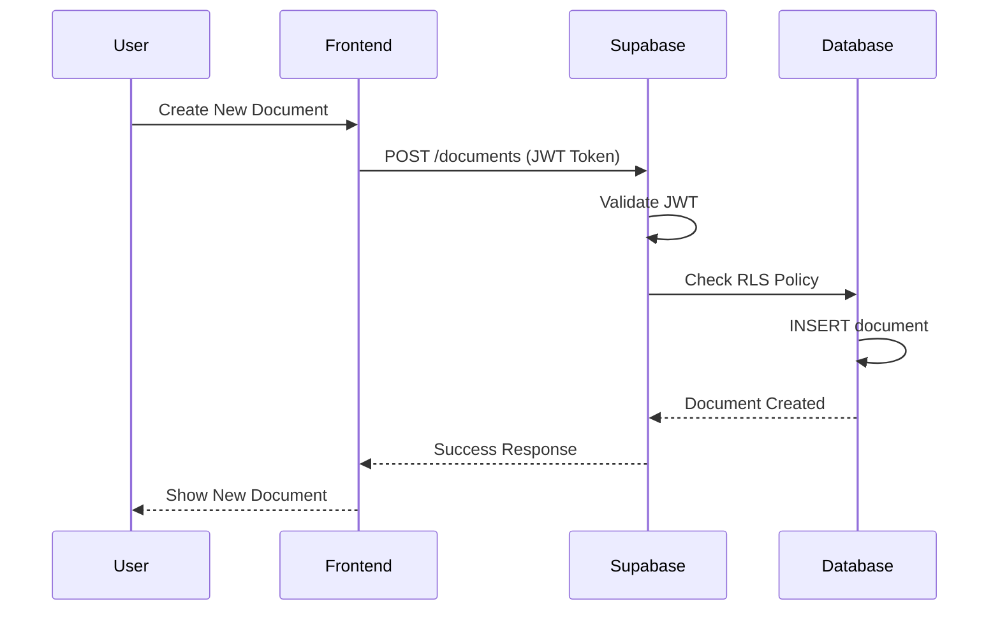

# WriteWise Agent 📝

> AI-Powered Writing Productivity Platform with Real-Time Collaboration

[](https://writewise-app.vercel.app)
[](https://www.typescriptlang.org/)
[](https://reactjs.org/)
[](LICENSE)

**[Live Demo](https://writewise-app.vercel.app)** | **[Report Bug](https://github.com/Teleiosite/writewise-agent/issues)** | **[Request Feature](https://github.com/Teleiosite/writewise-agent/issues)**

---

## 📖 Overview

WriteWise Agent is a comprehensive, full-stack SaaS writing productivity platform designed to enhance the writing process through AI-powered assistance, intelligent document analysis, and seamless project management. Built with modern web technologies and deployed on production infrastructure, it serves as a professional writing companion for students, academics, and content creators.

### 🎯 Key Highlights

- ✅ **Full-Stack Production Deployment** - Live on Vercel with Supabase backend
- ✅ **Multi-User Authentication** - Secure user management with email/password authentication
- ✅ **Real-Time Data Persistence** - PostgreSQL database with Row-Level Security
- ✅ **AI Integration Framework** - Ready for production AI API integration
- ✅ **Responsive Design** - Mobile-first approach with dark/light theme support

---

## ✨ Features

### Core Functionality

#### 🤖 AI-Powered Writing Tools
- **AI Content Detector** - Identifies AI-generated content with confidence scoring
- **Text Humanizer** - Converts AI-generated text to natural, human-like writing
- **Grammar & Style Suggestions** - Real-time writing feedback and improvements
- **Content Generation** - AI-assisted content creation based on prompts

#### 📚 Document Management
- **Project-Based Organization** - Create and manage multiple writing projects
- **Rich-Text Editor** - Comprehensive formatting toolbar with Markdown support
- **Document Templates** - Pre-built templates for essays, reports, articles, and more
- **Auto-Save** - Automatic document saving to prevent data loss

#### 📖 Citation Management
- **Multiple Citation Styles** - Support for APA, MLA, Chicago, and more
- **Citation Search** - Import citations from external academic databases
- **Manual Entry** - Create and edit custom citations
- **In-Text Citations** - Insert formatted citations directly into documents
- **Bibliography Generation** - Automatic reference list creation

#### 📄 PDF Interaction
- **Built-in PDF Reader** - View and annotate PDF documents in-browser
- **PDF Chat** - Interactive Q&A interface for PDF documents
- **Document Search** - Quick text search within uploaded PDFs
- **Annotation Support** - Highlight and note important sections

#### 📊 Analytics & Insights
- **Writing Statistics** - Word count, reading time, and productivity metrics
- **Goal Tracking** - Set and monitor daily/weekly writing targets
- **Progress Visualization** - Charts and graphs for writing habits
- **Content Distribution Analysis** - Breakdown by document sections

### User Experience

- 🎨 **Modern UI/UX** - Clean, intuitive interface built with shadcn/ui
- 🌓 **Theme Support** - Light and dark mode with system preference detection
- 📱 **Responsive Design** - Optimized for desktop, tablet, and mobile devices
- 🔔 **Real-Time Notifications** - Toast notifications for actions and updates
- ⚡ **Fast Performance** - Optimized loading with code splitting and lazy loading

---

## 🏗️ System Architecture

### High-Level Architecture


### Database Schema


### Request Flow


## 🏗️ System Architecture

### High-Level Architecture
```
┌──────────────────────────────────────────────────────┐
│              PRESENTATION LAYER                      │
│                                                      │
│  React Frontend (Vercel)                            │
│  ├─ Dashboard (Analytics & Overview)                │
│  ├─ Writing Editor (Rich-Text)                      │
│  ├─ Project Manager (CRUD)                          │
│  ├─ Citation Manager                                │
│  ├─ PDF Reader & Chat                               │
│  └─ Authentication UI                               │
│                                                      │
└──────────────┬───────────────────────────────────────┘
               │
               │ HTTPS/REST API + JWT Auth
               │
               ▼
┌──────────────────────────────────────────────────────┐
│              BACKEND LAYER (Supabase)                │
│                                                      │
│  PostgreSQL Database                                │
│  ├─ users (auth & profiles)                         │
│  ├─ projects (writing projects)                     │
│  ├─ documents (individual docs)                     │
│  ├─ citations (references)                          │
│  └─ analytics (usage stats)                         │
│                                                      │
│  Authentication Service                             │
│  ├─ Email/Password auth                             │
│  ├─ JWT tokens                                      │
│  └─ Session management                              │
│                                                      │
│  Storage Service                                    │
│  ├─ Document files                                  │
│  ├─ PDF uploads                                     │
│  └─ User content                                    │
│                                                      │
└──────────────┬───────────────────────────────────────┘
               │
               │ API Calls (Planned)
               │
               ▼
┌──────────────────────────────────────────────────────┐
│          EXTERNAL SERVICES (In Development)          │
│                                                      │
│  ├─ OpenAI API (Content generation)                 │
│  ├─ Gemini API (Alternative AI)                     │
│  ├─ Citation APIs (Academic search)                 │
│  └─ Plagiarism Detection                            │
└──────────────────────────────────────────────────────┘
```

### Technology Stack

#### Frontend
```yaml
Framework: React 19
Language: TypeScript 5.0
Build Tool: Vite 6.0
Styling: Tailwind CSS 3.4
UI Components: shadcn/ui (Radix UI primitives)
State Management: React Context API + Custom Hooks
Routing: React Router DOM 7.0
Icons: Lucide React
Rich Text Editor: Custom implementation with formatting toolbar
PDF Handling: pdfjs-dist, mammoth
Charts: Recharts
```

#### Backend (BaaS)
```yaml
Platform: Supabase
Database: PostgreSQL 15
Authentication: Supabase Auth (JWT-based)
Storage: Supabase Storage (S3-compatible)
Real-time: PostgreSQL triggers + Supabase Realtime (planned)
Row-Level Security: Enabled for all tables
```

#### DevOps & Deployment
```yaml
Hosting: Vercel (Serverless)
CI/CD: GitHub + Vercel (automatic deployments)
Environment: Production & Development environments
SSL/TLS: Automatic via Vercel
CDN: Vercel Edge Network (global)
Monitoring: Vercel Analytics (planned)
```

---

## 🗄️ Database Schema

### Core Tables

```sql
-- Users (managed by Supabase Auth)
CREATE TABLE users (
  id UUID PRIMARY KEY REFERENCES auth.users,
  email VARCHAR(255) UNIQUE NOT NULL,
  full_name VARCHAR(255),
  avatar_url TEXT,
  created_at TIMESTAMPTZ DEFAULT NOW(),
  updated_at TIMESTAMPTZ DEFAULT NOW()
);

-- Projects
CREATE TABLE projects (
  id UUID PRIMARY KEY DEFAULT uuid_generate_v4(),
  user_id UUID REFERENCES users(id) ON DELETE CASCADE,
  title VARCHAR(255) NOT NULL,
  description TEXT,
  status VARCHAR(50) DEFAULT 'active',
  created_at TIMESTAMPTZ DEFAULT NOW(),
  updated_at TIMESTAMPTZ DEFAULT NOW()
);

-- Documents
CREATE TABLE documents (
  id UUID PRIMARY KEY DEFAULT uuid_generate_v4(),
  project_id UUID REFERENCES projects(id) ON DELETE CASCADE,
  user_id UUID REFERENCES users(id) ON DELETE CASCADE,
  title VARCHAR(255) NOT NULL,
  content TEXT,
  word_count INTEGER DEFAULT 0,
  status VARCHAR(50) DEFAULT 'draft',
  created_at TIMESTAMPTZ DEFAULT NOW(),
  updated_at TIMESTAMPTZ DEFAULT NOW()
);

-- Citations
CREATE TABLE citations (
  id UUID PRIMARY KEY DEFAULT uuid_generate_v4(),
  user_id UUID REFERENCES users(id) ON DELETE CASCADE,
  document_id UUID REFERENCES documents(id) ON DELETE CASCADE,
  citation_type VARCHAR(50) NOT NULL,
  citation_style VARCHAR(50) NOT NULL,
  citation_data JSONB NOT NULL,
  created_at TIMESTAMPTZ DEFAULT NOW()
);

-- Analytics
CREATE TABLE analytics (
  id UUID PRIMARY KEY DEFAULT uuid_generate_v4(),
  user_id UUID REFERENCES users(id) ON DELETE CASCADE,
  event_type VARCHAR(100) NOT NULL,
  event_data JSONB,
  created_at TIMESTAMPTZ DEFAULT NOW()
);
```

### Row-Level Security (RLS)

```sql
-- Users can only read/update their own data
ALTER TABLE projects ENABLE ROW LEVEL SECURITY;
CREATE POLICY "Users can manage own projects" ON projects
  FOR ALL USING (auth.uid() = user_id);

ALTER TABLE documents ENABLE ROW LEVEL SECURITY;
CREATE POLICY "Users can manage own documents" ON documents
  FOR ALL USING (auth.uid() = user_id);

ALTER TABLE citations ENABLE ROW LEVEL SECURITY;
CREATE POLICY "Users can manage own citations" ON citations
  FOR ALL USING (auth.uid() = user_id);
```

---

## 📁 Project Structure

```
writewise-agent/
├── public/                      # Static assets
│   ├── fonts/                   # Custom fonts
│   └── images/                  # Image assets
│
├── src/
│   ├── components/              # React components
│   │   ├── dashboard/          # Dashboard components
│   │   │   ├── Overview.tsx
│   │   │   ├── RecentProjects.tsx
│   │   │   └── WritingStats.tsx
│   │   │
│   │   ├── editor/             # Writing editor components
│   │   │   ├── EditorToolbar.tsx
│   │   │   ├── TextEditor.tsx
│   │   │   └── FormatPanel.tsx
│   │   │
│   │   ├── citations/          # Citation management
│   │   │   ├── CitationForm.tsx
│   │   │   ├── CitationList.tsx
│   │   │   └── StyleSelector.tsx
│   │   │
│   │   ├── pdf/                # PDF interaction
│   │   │   ├── PDFReader.tsx
│   │   │   └── PDFChat.tsx
│   │   │
│   │   ├── auth/               # Authentication
│   │   │   ├── LoginForm.tsx
│   │   │   ├── RegisterForm.tsx
│   │   │   └── PasswordReset.tsx
│   │   │
│   │   └── ui/                 # Reusable UI components (shadcn/ui)
│   │       ├── button.tsx
│   │       ├── card.tsx
│   │       ├── dialog.tsx
│   │       └── [40+ components]
│   │
│   ├── contexts/                # React Context providers
│   │   ├── AuthContext.tsx     # Authentication state
│   │   ├── ThemeContext.tsx    # Theme management
│   │   └── ProjectContext.tsx  # Project state
│   │
│   ├── hooks/                   # Custom React hooks
│   │   ├── useAuth.ts          # Authentication hook
│   │   ├── useProjects.ts      # Project management
│   │   ├── useDocuments.ts     # Document operations
│   │   └── useAnalytics.ts     # Analytics tracking
│   │
│   ├── lib/                     # Utility libraries
│   │   ├── supabase.ts         # Supabase client config
│   │   ├── utils.ts            # Helper functions
│   │   └── validators.ts       # Input validation
│   │
│   ├── pages/                   # Page components
│   │   ├── Dashboard.tsx       # Main dashboard
│   │   ├── Editor.tsx          # Writing editor
│   │   ├── Projects.tsx        # Project list
│   │   ├── Citations.tsx       # Citation manager
│   │   ├── Analytics.tsx       # Analytics page
│   │   ├── Settings.tsx        # User settings
│   │   ├── Login.tsx           # Login page
│   │   └── Register.tsx        # Registration
│   │
│   ├── services/                # API service layers
│   │   ├── projectService.ts   # Project CRUD
│   │   ├── documentService.ts  # Document CRUD
│   │   ├── citationService.ts  # Citation operations
│   │   └── analyticsService.ts # Analytics tracking
│   │
│   ├── types/                   # TypeScript type definitions
│   │   ├── database.types.ts   # Supabase generated types
│   │   ├── project.types.ts    # Project types
│   │   └── document.types.ts   # Document types
│   │
│   ├── App.tsx                  # Main app component
│   ├── main.tsx                 # Entry point
│   └── index.css                # Global styles
│
├── .env.example                 # Environment variables template
├── .gitignore                   # Git ignore rules
├── package.json                 # Dependencies
├── tsconfig.json                # TypeScript config
├── tailwind.config.js           # Tailwind CSS config
├── vite.config.ts               # Vite configuration
└── README.md                    # This file
```

---

## 🚀 Getting Started

### Prerequisites

- **Node.js** 20.x or higher
- **npm** 9.x or higher
- **Git** for version control
- **Supabase Account** (for backend services)

### Installation

1. **Clone the repository**
   ```bash
   git clone https://github.com/Teleiosite/writewise-agent.git
   cd writewise-agent
   ```

2. **Install dependencies**
   ```bash
   npm install --legacy-peer-deps
   ```
   
   > Note: The `--legacy-peer-deps` flag resolves peer dependency conflicts with React 19 and some packages. This is a temporary workaround.

3. **Set up environment variables**
   
   Create a `.env` file in the root directory:
   ```bash
   cp .env.example .env
   ```
   
   Add your Supabase credentials:
   ```env
   VITE_SUPABASE_URL=your-project-url.supabase.co
   VITE_SUPABASE_ANON_KEY=your-anon-key
   ```

4. **Start the development server**
   ```bash
   npm run dev
   ```
   
   The application will be available at `http://localhost:5173`

### Building for Production

```bash
# Create production build
npm run build

# Preview production build locally
npm run preview
```

---

## 🔧 Configuration

### Supabase Setup

1. **Create a Supabase project** at [supabase.com](https://supabase.com)

2. **Configure authentication**
   - Navigate to Authentication → Providers
   - Enable Email provider
   - Configure redirect URLs:
     - Development: `http://localhost:5173/**`
     - Production: `https://your-domain.vercel.app/**`

3. **Set up database tables**
   - Run the SQL commands from the [Database Schema](#database-schema) section
   - Enable Row-Level Security on all tables

4. **Configure storage** (optional)
   - Create storage buckets for user uploads
   - Set appropriate access policies

### Vercel Deployment

1. **Connect repository to Vercel**
   ```bash
   # Install Vercel CLI
   npm i -g vercel
   
   # Deploy
   vercel
   ```

2. **Configure environment variables** in Vercel Dashboard
   - Add `VITE_SUPABASE_URL`
   - Add `VITE_SUPABASE_ANON_KEY`

3. **Enable automatic deployments**
   - Vercel will automatically deploy on `git push`

---

## 📊 Current Status

### ✅ Completed Features

- [x] Full-stack authentication system (email/password)
- [x] Multi-user database with RLS
- [x] Project creation and management
- [x] Document CRUD operations
- [x] Rich-text editor with formatting
- [x] Citation management system
- [x] PDF reader integration
- [x] Dashboard with analytics
- [x] Responsive UI with dark/light themes
- [x] Production deployment (Vercel + Supabase)
- [x] Automatic CI/CD pipeline

### 🚧 In Progress

- [ ] AI content generation integration (OpenAI/Gemini API)
- [ ] Real-time collaboration features
- [ ] Advanced PDF chat with RAG
- [ ] Plagiarism detection
- [ ] Export to multiple formats (PDF, DOCX, Markdown)
- [ ] Mobile app (React Native)

### 🐛 Known Issues

1. **Dependency Conflicts**
   - `next-themes` peer dependency conflict with React 19
   - **Workaround:** Using `--legacy-peer-deps` flag
   - **Status:** Monitoring for upstream fix

2. **AI Features**
   - Current AI suggestions are placeholders
   - **Status:** API integration in development
   - **ETA:** Next release

3. **PDF Processing**
   - Large PDF files (>10MB) may be slow
   - **Status:** Optimization planned
   - **Workaround:** Compress PDFs before upload

---

## 🛣️ Roadmap

### Phase 1: Core Enhancement (Q1 2025)
- [ ] Complete OpenAI/Gemini API integration
- [ ] Implement real-time AI suggestions
- [ ] Add collaborative editing (multiple users)
- [ ] Enhance PDF chat with RAG capabilities
- [ ] Performance optimizations

### Phase 2: Advanced Features (Q2 2025)
- [ ] Plagiarism detection service
- [ ] Grammar checker with advanced rules
- [ ] Voice-to-text dictation
- [ ] Document version history
- [ ] Team workspaces

### Phase 3: Mobile & Integrations (Q3 2025)
- [ ] React Native mobile app
- [ ] Browser extensions (Chrome, Firefox)
- [ ] API for third-party integrations
- [ ] Zapier/Make.com integrations
- [ ] Google Docs/Microsoft Word plugins

### Phase 4: Enterprise Features (Q4 2025)
- [ ] SSO (Single Sign-On) support
- [ ] Advanced analytics dashboard
- [ ] Custom branding options
- [ ] Audit logs and compliance features
- [ ] Self-hosted deployment option

---

## 🧪 Testing

```bash
# Run unit tests
npm run test

# Run E2E tests
npm run test:e2e

# Generate coverage report
npm run test:coverage
```

---

## 🤝 Contributing

Contributions make the open-source community an amazing place to learn and create. Any contributions you make are **greatly appreciated**.

### How to Contribute

1. **Fork the Project**
2. **Create your Feature Branch**
   ```bash
   git checkout -b feature/AmazingFeature
   ```
3. **Commit your Changes**
   ```bash
   git commit -m 'Add some AmazingFeature'
   ```
4. **Push to the Branch**
   ```bash
   git push origin feature/AmazingFeature
   ```
5. **Open a Pull Request**

### Code Style

- Follow TypeScript best practices
- Use ESLint and Prettier for formatting
- Write meaningful commit messages
- Add comments for complex logic
- Update documentation as needed

---

## 📝 License

This project is licensed under the MIT License - see the [LICENSE](LICENSE) file for details.

---

## 👨‍💻 Author

**Abomide Oluwaseye**

- Email: abosey23@gmail.com
- LinkedIn: [linkedin.com/in/abomide-oluwaseye](https://linkedin.com/in/abomide-oluwaseye)
- GitHub: [@Teleiosite](https://github.com/Teleiosite)
- Portfolio: [Live Demo](https://writewise-app.vercel.app)

---

## 🙏 Acknowledgments

- [React](https://reactjs.org/) - UI framework
- [Vite](https://vitejs.dev/) - Build tool
- [Supabase](https://supabase.com/) - Backend-as-a-Service
- [Tailwind CSS](https://tailwindcss.com/) - CSS framework
- [shadcn/ui](https://ui.shadcn.com/) - Component library
- [Vercel](https://vercel.com/) - Deployment platform
- [Lucide](https://lucide.dev/) - Icon library

---

## 📚 Documentation

For more detailed documentation, please refer to:

- [API Documentation](docs/API.md) (coming soon)
- [Component Documentation](docs/COMPONENTS.md) (coming soon)
- [Deployment Guide](docs/DEPLOYMENT.md) (coming soon)
- [Contributing Guidelines](CONTRIBUTING.md) (coming soon)

---

## 📞 Support

If you have any questions or need help, please:

- 📧 Email: abosey23@gmail.com
- 🐛 [Open an issue](https://github.com/Teleiosite/writewise-agent/issues)
- 💬 [Start a discussion](https://github.com/Teleiosite/writewise-agent/discussions)

---

<div align="center">

**[⬆ back to top](#writewise-agent-)**

Made with ❤️ by [Abomide Oluwaseye](https://github.com/Teleiosite)

</div>
